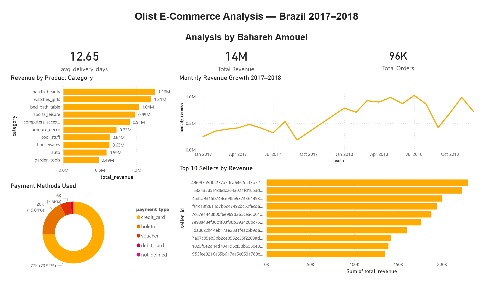
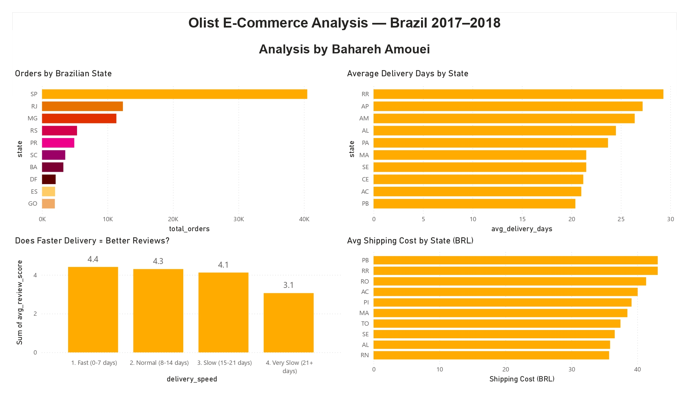

# Olist E-Commerce Performance Analysis — Brazil 2017–2018

**Tools:** Excel · SQL (SQLite) · Power BI  
**Dataset:** Olist Brazilian E-Commerce (Kaggle)  
**Orders Analyzed:** 96,478 delivered orders (from 99,441 total)  
**Status:** Completed ✅

---

## Overview

Olist is Brazil's largest e-commerce marketplace, connecting small 
businesses to major sales channels across the country. This project 
analyzes nearly 100,000 real orders from 2017–2018 to uncover revenue 
patterns, delivery bottlenecks, and customer satisfaction drivers 
across Brazil's 27 states — simulating the day-to-day analytical work 
of a business analyst in an e-commerce or retail company.

The dataset contains 9 interconnected CSV files covering orders, 
customers, products, sellers, payments, and reviews — requiring SQL 
joins across multiple tables to extract meaningful insights.

---

## Dashboard Preview

---

## Business Questions Answered

1. Which product categories generate the most revenue?
2. Which Brazilian states place the most orders?
3. What is the average delivery time — and which states are slowest?
4. Does faster delivery lead to better customer reviews?
5. How did monthly revenue grow over 2017–2018?
6. Which sellers generate the most revenue?
7. What payment methods do customers prefer?
8. Which states have the highest shipping costs?

---

## Key Findings

- **Health & Beauty** is the #1 revenue category with 1.26M BRL 
  in sales, followed by Watches & Gifts at 1.21M BRL
- **São Paulo** accounts for 40,501 orders — 42% of all deliveries 
  nationwide, making it by far the dominant market
- **Average delivery time is 12.5 days**, but remote northern states 
  like Roraima and Amapá average over 28 days — more than double
- **Delivery speed directly impacts customer satisfaction:** fast 
  deliveries under 7 days score 4.4/5 in reviews, while very slow 
  deliveries over 21 days drop to 3.1/5 — a full point lower
- **Revenue grew nearly 3x in 18 months**, from ~350K BRL/month 
  in early 2017 to over 1M BRL/month by mid-2018
- **Credit card dominates** at 73.9% of all transactions, followed 
  by boleto (Brazilian bank slip) at 19%
- **Northern and northeastern states pay up to 40 BRL more** in 
  shipping costs — directly explaining their slower delivery times 
  and lower order volumes compared to the southeast
- **97% delivery rate** — 96,478 out of 99,441 orders were 
  successfully delivered, showing strong operational reliability

---

## Process

**1. Excel — Data Cleaning**
- Imported 9 raw CSV files from Kaggle
- Filtered orders to delivered status only: 96,478 rows from 99,441
- Added `delivery_days` column using date formula: `=DAYS(G2,D2)`
- Calculated key stats: avg 12.5 days, max 210 days, min 0 days
- Saved clean file as `olist_orders_clean.xlsx`

**2. SQL — Analysis (SQLite via DB Browser)**
- Imported 5 tables: orders, order_items, products, 
  customers, category_translation
- Wrote 8 queries using JOIN, GROUP BY, AVG, SUM, COUNT, CASE WHEN
- Joined up to 3 tables in a single query to connect orders 
  to products to categories
- Exported each query result as a separate CSV file

**3. Power BI — Dashboard**
- Imported all result CSVs into Power BI
- Built 2-page dashboard: Sales Overview + Delivery & Operations
- Created 3 KPI cards: Total Orders, Total Revenue, Avg Delivery Days
- Built 8 visualizations covering revenue, geography, 
  delivery, satisfaction, and payment behavior
- Applied consistent corporate blue color scheme (#0070C0)

---

## Dashboard Pages

**Page 1 — Sales Overview**
- Revenue by product category (bar chart)
- Monthly revenue growth 2017–2018 (line chart)
- Top 10 sellers by revenue (bar chart)
- Payment methods breakdown (donut chart)
- KPI cards: 96K orders · 14M BRL revenue · 12.65 avg delivery days

**Page 2 — Delivery & Operations**
- Orders by Brazilian state (bar chart)
- Average delivery days by state (bar chart)
- Delivery speed vs customer review score (column chart)
- Average shipping cost by state (bar chart)

---

## Files in This Repository

| File | Description |
|------|-------------|
| `Project1_Olist_Analysis_Bahareh_Amouei.pdf` | Full Power BI dashboard PDF |
| `Olist_Dashboard_Bahareh.pbix` | Power BI source file |
| `olist_orders_clean.xlsx` | Cleaned orders data (delivered only) |
| `results_top_categories.xlsx` | Revenue by product category |
| `results_by_state.csv` | Orders by Brazilian state |
| `results_delivery_by_state.csv` | Avg delivery days per state |
| `results_monthly_revenue_clean.csv` | Monthly revenue 2017–2018 |
| `results_payment_types.csv` | Payment method breakdown |
| `results_reviews_vs_delivery.csv` | Review scores by delivery speed |
| `results_top_sellers.csv` | Top 10 sellers by revenue |
| `results_freight_by_state.csv` | Avg shipping cost by state |

---

## Data Source

[Olist Brazilian E-Commerce Dataset](https://www.kaggle.com/datasets/olistbr/brazilian-ecommerce) — Kaggle  
9 CSV files · 99,441 orders · Real transaction data from 2016–2018

---

## About Me

I am Bahareh Amouei, a Master's student in Human-Computer Interaction 
at Bauhaus-Universität Weimar, Germany. With a background in UX research 
and human-centered design, I am building data analytics skills to pursue 
Werkstudent and internship roles in Germany in 2026.

[LinkedIn](https://www.linkedin.com/in/bahareh-amouei) · [Spotify Project](https://github.com/baharehamouei/spotify-music-analysis)
